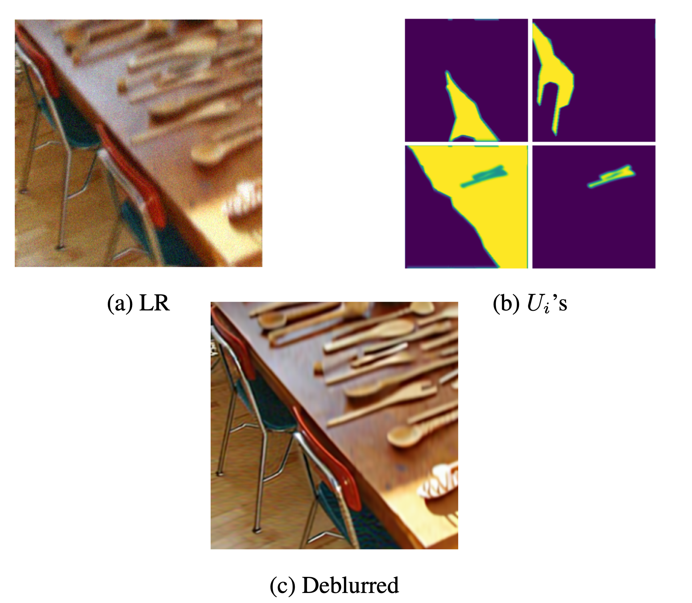
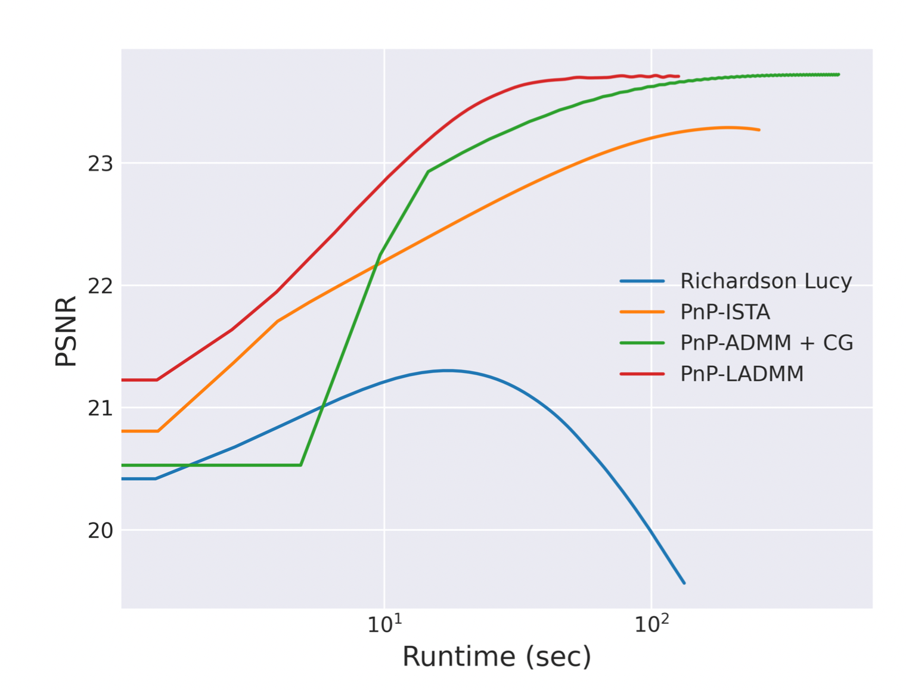
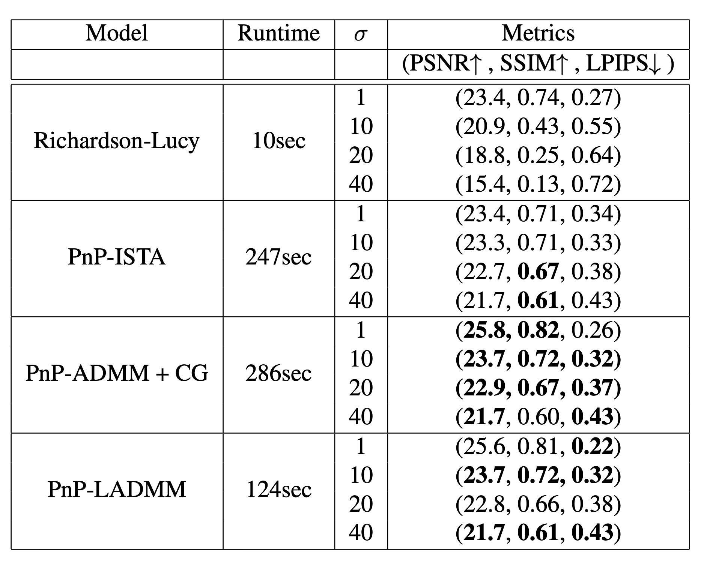

# Plug & Play linearized ADMM

<a href="https://arxiv.org/abs/2210.10605" target="_blank" rel="noopener"></a>  
[Website of the project](https://claroche-r.github.io/PnP_LADMM/) 

## Introduction
This repository implements the code used for our paper **Provably Convergent Plug & Play Linearized ADMM, applied to Deblurring Spatially Varying Kernels**. This is joint work with **Andrés Almansa**, **Eva Coupeté** and **Matias Tassano**.

## Abstract

Plug & Play methods combine proximal algorithms with denoiser priors to solve inverse problems. These methods rely on the computability of the proximal operator of the data fidelity term. In this paper, we propose a Plug & Play framework based on linearized ADMM that allows us to bypass the computation of intractable proximal operators. We demonstrate the convergence of the algorithm and provide results on restoration tasks such as super-resolution and deblurring with non-uniform blur.

## Deblurring images with spatially-varying blur

- Example of deblurring on spatially-varying blur:



- Convergence speed comparison:



- Performance results:




## Acknowledgement
This code use the backbone of [KAIR repository](https://github.com/cszn/KAIR).

## Citation

```
@article{laroche2022pnpladmm,
  title = {Provably Convergent Plug \& Play Linearized ADMM, applied to Deblurring Spatially Varying Kernels},
  author = {Laroche, Charles and Almansa, Andrés and Coupeté, Eva and Tassano, Matias},
  publisher = {arXiv},
  year = {2022}
}
```


