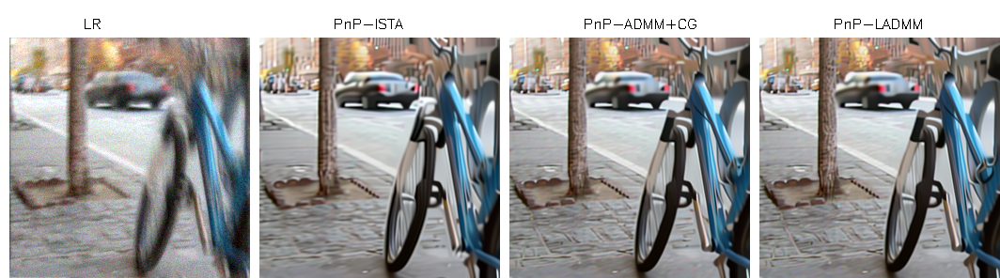
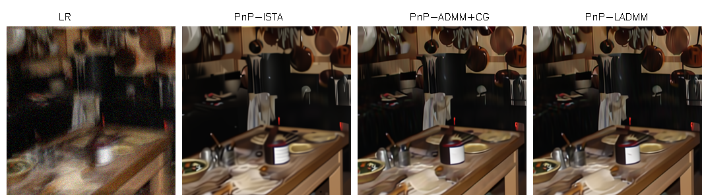

# Plug & Play linearized ADMM

<a href="https://arxiv.org/abs/2210.10605" target="_blank" rel="noopener"></a>  

## Introduction
This repository implements the code used for our paper **Provably Convergent Plug & Play Linearized ADMM, applied to Deblurring Spatially Varying Kernels**. This is joint work with **Andrés Almansa**, **Eva Coupeté** and **Matias Tassano**.

## 

## Abstract

Plug & Play methods combine proximal algorithms with denoiser priors to solve inverse problems. These methods rely on the computability of the proximal operator of the data fidelity term. In this paper, we propose a Plug & Play framework based on linearized ADMM that allows us to bypass the computation of intractable proximal operators. We demonstrate the convergence of the algorithm and provide results on restoration tasks such as super-resolution and deblurring with non-uniform blur.

## Repository organization

All the models presented and tested in our article are implemented in the folder ```models```. 

See ```tuto_pnp.py``` for a working example on how to use our code. 


## Deblurring images with spatially-varying blur

- We test our Plug & Play algorithm on the challenging task deblurring on spatially-varying blur:


- Convergence speed comparison:


- Performance results:


- Visual results:



    

## Unfolded architecture

If you are interested in faster runtime and better restoration quality, check our unfolded version of Plug & Play linearized-ADMM  called [DMBSR](https://github.com/claroche-r/DMBSR).


## Acknowledgement
This code use the backbone of [KAIR repository](https://github.com/cszn/KAIR).

## Citation

```
@INPROCEEDINGS{laroche2023pnpladmm,
  author={Laroche, Charles and Almansa, Andrés and Coupeté, Eva and Tassano, Matias},
  booktitle={IEEE International Conference on Acoustics, Speech and Signal Processing (ICASSP)}, 
  title={Provably Convergent Plug & Play Linearized ADMM, Applied to Deblurring Spatially Varying Kernels}, 
  year={2023}}
```


